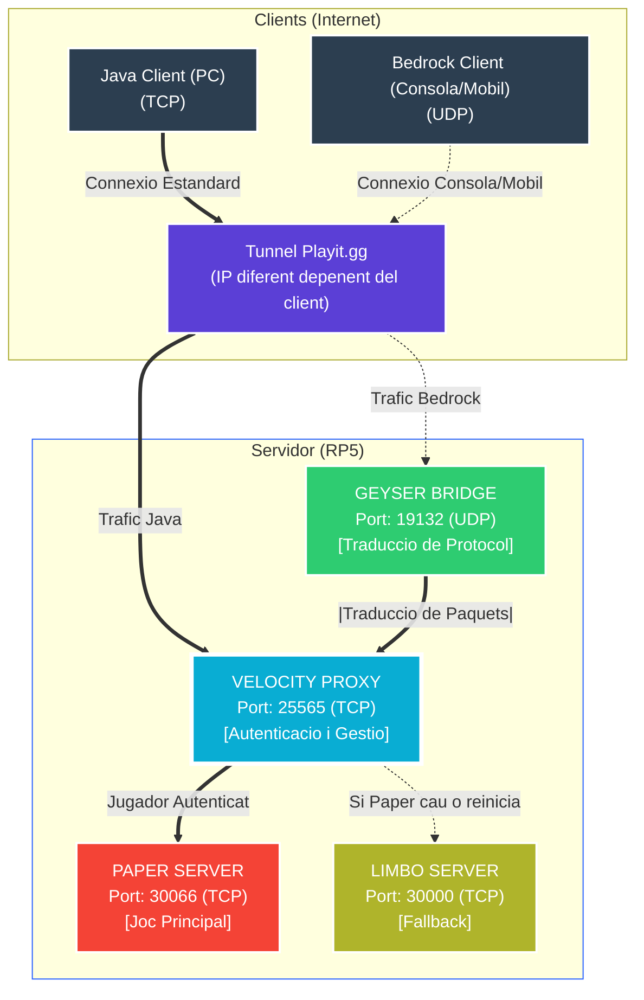

<div align="center">

# PiBlock 


**Servidors Minecraft per a Instituts: Fàcil, Ràpid i complert**

</div>

---

## 📌 Què és això?

**PiBlock** és un sistema que converteix una petita **Raspberry Pi 5** en un servidor professional de Minecraft.

La seva màgia és que permet jugar a tothom, sense importar si tenen un ordinador potent (Java) o juguen des del mòbil o la consola (Bedrock). Tot està integrat i funciona automàticament.

---

## 🏗️ Com funciona tècnicament?

A sota pots veure exactament com viatgen les paquets des de els clients fins al servidor.



### 💡 Explicació

Encara que el gràfic sembli complex, el procés segueix 3 passos simples:

1.  **Tunnel (Playit.gg):**
    *   Tothom entra per la mateixa porta (`Playit.gg`), sigui des de PC o Mòbil. Això evita haver de tocar la configuració del router.
    *   JAVA i BEDROCK tenen ports diferents per a connectar-se al servidor!!!

2.  **Filtre (Velocity i Geyser):**
    *   Si vens de **PC (Java)**, passes directament desde el tunnel a (`Velocity`, port 25565).
    *   Si vens de **Mòbil/Consola (Bedrock)**, parles un "idioma" diferent (UDP). Primer passes pel traductor (`Geyser`, port 19132), que converteix les teves dades perquè el porter t'entengui.

3.  **Joc (Paper o Limbo):**
    *   Un cop a dins, Velocity t'envia al servidor de joc (`Paper`, port 30066) per jugar.
    *   Si el joc s'està reiniciant o hi ha un error, en lloc d'expulsar-te, t'envia automàticament a la sala d'espera (`Limbo`, port 30000) fins que tot torni a funcionar.

---
## Instalació

- --L'instalació automatica encara esta sent desenvolupada--
  
## 🚀 Com engegar-ho

Per a engegar has d'obrir l'arxiu start_all.bat en windows, i tenim planejada una per a Linux.

```bat
start_all.bat
```
*Això obrirà automàticament tots els 4 processos necessaris en l'ordre correcte.*

---

## 👥 Equip de PiBlock

**Creat amb passió.**

[](https://github.com/dimova5/PiBlock/graphs/contributors)

<div align="center">
    <sub>Distribuït sota <b>MIT License</b></sub>
</div>
